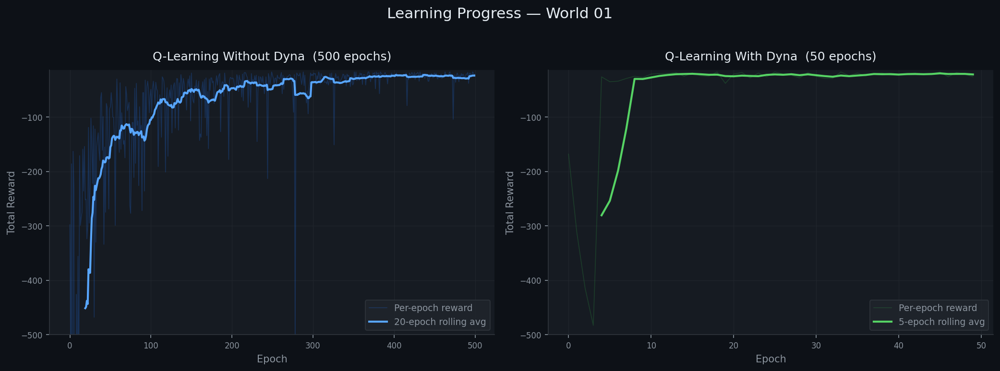
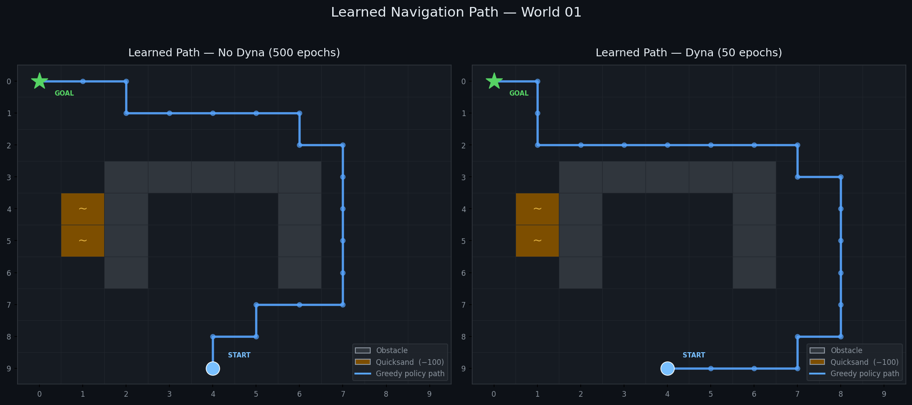
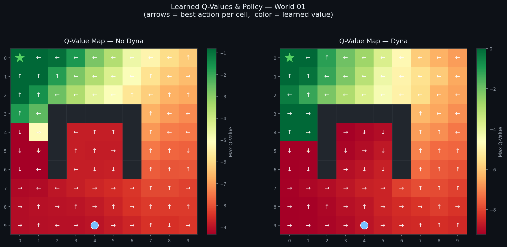

# Reinforcement Learning Robot

A reinforcement learning project where a robot learns to navigate a 10x10 grid maze entirely from experience — developing an optimal path to the goal through repeated trial episodes, guided by a structured reward function.

If curious to learn more, code is available upon request for recruiters and potential employers.

---

## Overview

The robot starts with zero knowledge of its environment and learns purely through interaction. At each step it receives a reward signal, and over many episodes it builds up a table of learned values — eventually converging on an efficient, obstacle-avoiding path to the goal.

The project implements two variants of Q-Learning and compares their convergence speed:

- **Standard Q-Learning** — learns from real experience over 500 episodes
- **Dyna Q-Learning** — augments real experience with simulated replays, converging in just 50 episodes

---

## The Environment

Each world is a 10x10 grid loaded from a CSV file. Cells are encoded as follows:

| Value | Meaning |
|---|---|
| `0` | Empty space |
| `1` | Obstacle (impassable) |
| `2` | Robot start position |
| `3` | Goal |
| `5` | Quicksand (−100 reward penalty) |

The robot must navigate from its start position to the goal while learning to avoid obstacles and quicksand. 10 different world layouts are included in `testworlds/`, ranging in difficulty.

---

## Q-Learning Algorithm

Q-Learning builds a table `Q[state, action]` — an estimate of how valuable it is to take a given action from a given state. After each step, the table is updated using:

```
Q[s, a] = (1 − α) · Q[s, a] + α · (reward + γ · max Q[s', :])
```

- **α (alpha = 0.2)** — learning rate: how strongly new experience updates old estimates
- **γ (gamma = 0.9)** — discount factor: how much future rewards are valued relative to immediate ones

**States** are the 100 grid positions, encoded as `row × 10 + col`. **Actions** are the 4 cardinal directions (N, E, S, W).

### Reward Function

| Outcome | Reward |
|---|---|
| Reaching the goal | +1 |
| Each step taken | −1 |
| Stepping on quicksand | −100 |

The −1 per-step penalty drives the robot toward finding the *shortest* path, not just any path.

### Exploration vs. Exploitation

The robot uses an **epsilon-greedy** strategy. Early in training it takes mostly random actions (exploration) to discover the environment. The random action rate decays over time, gradually shifting toward exploiting the best-known actions. There is also a fixed 20% chance each step that the robot's intended move is overridden by a random direction — simulating a noisy, real-world environment.

---

## Dyna: Planning with Experience Replay

Standard Q-Learning only learns from real interactions. **Dyna** extends this by replaying past experiences synthetically: after each real step, the agent performs 200 additional Q-table updates by sampling random transitions from its memory buffer.

This allows the robot to extract far more learning from each real episode — achieving comparable performance in **50 episodes** versus **500** for standard Q-Learning.

---

## Results

All results shown below are from **World 01** — a 10x10 maze with an obstacle block in the center and two quicksand traps to the left.

### Learning Curves

Shows how total reward per episode improves over training. The robot starts by wandering randomly (low reward) and progressively learns a more efficient path.



The left panel (standard Q-Learning) takes ~200 episodes to converge. The right panel (Dyna) converges in under 10 episodes — a direct result of experience replay compressing what would otherwise require hundreds of real interactions.

### Learned Navigation Path

The path traced by the robot's final learned policy, executed deterministically with no random actions.



Both variants successfully navigate around the obstacle block and avoid the quicksand cells. The Dyna path (right) takes a slightly different route due to its faster, more aggressive convergence with fewer real samples.

### Q-Value Heatmap & Policy Map

Every non-obstacle cell colored by its learned maximum Q-value, with an arrow indicating the best action the robot would take from that position.



Green cells (high value) cluster near the goal — the robot has learned that being close to the goal is good. Red cells (low value) are far from the goal or adjacent to quicksand. The arrows form a coherent policy that funnels the robot toward the top-left regardless of where it starts.

---

## Project Structure

```
Reinforcement-Learning-Robot/
├── QLearner.py                  # Q-Learning algorithm with Dyna support
├── testqlearner.py              # Navigation simulation and training harness
├── generate_visualizations.py  # Script to reproduce all result plots
├── testworlds/                  # 10 grid environments (world01–world10.csv)
└── results/                     # Output visualizations
    ├── learning_curve.png
    ├── learned_path.png
    └── qvalue_heatmap.png
```

---

## Reproducing the Results

Dependencies: Python 3.x, NumPy, matplotlib. The `QLearner.py` and `testqlearner.py` source files are available upon request.

```bash
python generate_visualizations.py
```

Output images are saved to `results/`.
